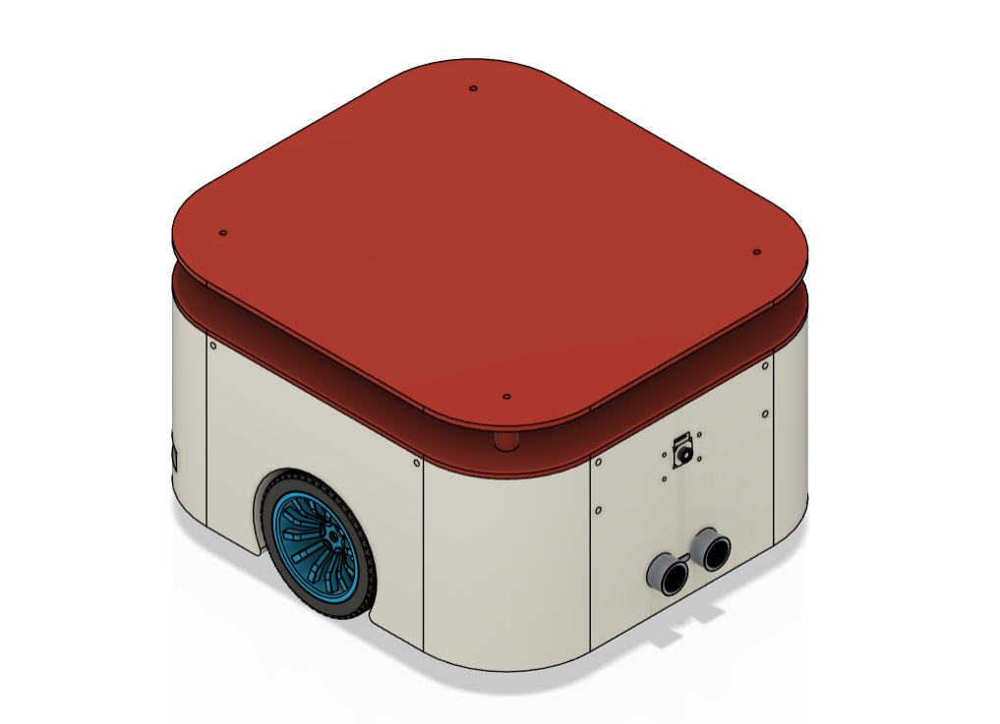
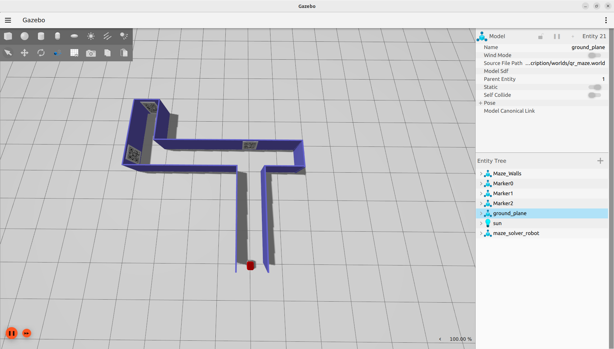
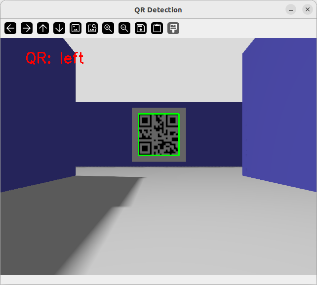

# 🤖 Autonomous Maze Solver Robot (ROS 2 Humble)


An Autonomous Mobile Robot (AMR) developed using **ROS 2 Humble** for maze-solving applications. The project features a custom differential drive robot modeled in **URDF/Xacro**, simulated in **Gazebo**, and equipped with LiDAR, Camera, and IMU sensors. It supports keyboard teleoperation, joystick control, ROS 2 Control, and QR code detection.

---

# 📌 Project Overview

This project focuses on designing and simulating an autonomous mobile robot capable of navigating a maze environment. The robot is built using ROS 2 with a modular package structure and realistic simulation in Gazebo.

Current functionalities include:

- Custom robot model using URDF/Xacro
- Differential drive robot
- Gazebo simulation
- ROS 2 Control integration
- LiDAR, Camera and IMU sensors
- Keyboard teleoperation
- Joystick control
- QR code detection using OpenCV

---

# ✨ Features

- Differential Drive Mobile Robot
- ROS 2 Humble
- Gazebo Simulation
- Custom URDF/Xacro Robot Model
- ROS2 Control
- LiDAR Integration
- Camera Integration
- IMU Integration
- Keyboard Teleoperation
- Joystick Teleoperation
- QR Code Detection
- Modular ROS2 Package Structure

---

# 🛠 Hardware Configuration

| Component | Description |
|-----------|-------------|
| Drive Type | Differential Drive |
| Wheels | 2 Driving Wheels |
| Support | Caster Wheel |
| Sensors | LiDAR, Camera, IMU |
| Controller | ROS2 Control |
| Simulation | Gazebo |

---

# 💻 Software Stack

- Ubuntu 22.04
- ROS 2 Humble
- Gazebo
- Python 3
- C++
- URDF
- Xacro
- OpenCV
- ros2_control
- YAML
- CMake

---

# 📂 Workspace Structure

```text
maze_solver_ws
│
├── src
│   ├── maze_solver_bringup
│   ├── maze_solver_controller
│   ├── maze_solver_description
│   └── maze_solver_scripts
│
├── images
│
├── README.md
├── LICENSE
└── .gitignore
```

---

# 📦 Package Description

## maze_solver_description

Contains:

- Robot URDF/Xacro files
- Gazebo plugins
- Robot meshes
- Robot worlds
- RViz configuration

Launch Files

- display.launch.py
- gazebo.launch.py

Worlds

- empty.world
- qr_maze.world
- small_house.world

---

## maze_solver_controller

Contains controller configuration for:

- ROS2 Control
- Differential Drive Controller
- Joystick Configuration
- Twist Mux

Launch Files

- controller.launch.py
- joystick.launch.py

Configuration Files

- mechabot_controllers.yaml
- joy_config.yaml
- joy_teleop.yaml
- twist_mux_topics.yaml
- twist_mux_locks.yaml
- twist_mux_joy.yaml

---

## maze_solver_bringup

Responsible for launching the complete robot simulation.

Launch File

- simulated_robot.launch.py

---

## maze_solver_scripts

Python nodes for robot sensing and perception.

Scripts

- maze_solver.py
- detect_marker.py
- read_camera.py
- read_lidar.py
- read_imu.py

---

# 🚀 Installation

Clone the repository

```bash
git clone https://github.com/<your-username>/maze_solver_ws.git
```

Go to workspace

```bash
cd maze_solver_ws
```

Install dependencies

```bash
rosdep install --from-paths src --ignore-src -r -y
```

---

# 🔨 Build

```bash
colcon build
```

Source the workspace

```bash
source install/setup.bash
```

---

# ▶ Running the Simulation

Launch the robot

```bash
ros2 launch maze_solver_bringup simulated_robot.launch.py
```

Launch controllers

```bash
ros2 launch maze_solver_controller controller.launch.py
```

Launch joystick

```bash
ros2 launch maze_solver_controller joystick.launch.py
```

---

## Robot Model



## Gazebo Simulation



## QR Code Detection



# 🔮 Future Improvements

- SLAM Mapping
- Autonomous Navigation using Nav2
- Dynamic Obstacle Avoidance
- Path Planning
- Restaurant Delivery Robot Extension
- Web Dashboard
- Voice Commands
- Raspberry Pi Deployment

---

# 📄 License

This project is licensed under the MIT License.

---

# 👩‍💻 Author

**Siddhi Bhosale**

Robotics Engineer | ROS2 Developer

GitHub:
https://github.com/siddhbhosale2406
